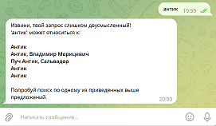

# ***
Инструкция к Telegram-боту
***

- *Разработали*
    + sylvamel (lider)
    + gormlail
    + theolada

---------------------------------------------------------------------------------------------------------------------------

[**infobot**](https://t.me/pr4_info_bot) - это наш чат-бот в Telegram на базе языка Python разработанный для ***"Project 4  REST API"*** в рамках обучения в ***School 21***

## Что умеет наш Telegram-бот?
- По Вашему запросу найти информацию на сайте Wikipedia
- Бот обрабатывает запросы на <kbd>english</kbd> и <kbd>русском</kbd> языках

## Как пользоваться Telegram-ботом?

1. Необходимо установить приложение Telegram [отсюда](https://telegram.org/) или воспользоваться веб-версией Telegram для браузера [здесь](https://web.telegram.org/), в том случае если он ранее не был установлен.

2. Найдите **infobot** через поисковую строку в приложении Telegram, введя название бота [**infobot**](https://t.me/pr4_info_bot), или перейдите по [ссылке](https://t.me/pr4_info_bot).

3. Вот и всё, Telegram ботом пориветствует Вас и подскажет Ваши дальнейшие действия.

4. Доступные команды в Telegram боте: 
    + <kbd>*/start*</kbd> - запуск бота,
    + <kbd>*/help*</kbd> - вызов доступных команд,
    + <kbd>*/eng*</kbd> - поиск статей на английском языке,
    + <kbd>*/rus*</kbd> - поиск статей на русском языке.

5. Ну и конечно Вы также можете ввести в любое слово на русском или английском языке, информацию о котором хотели бы быстро получить с сайта [Wikipedia](https://ru.wikipedia.org/wiki/).

           

6. Если введённого слова, нет на сайте Wikipedia, или оно введено с ошибкой, то Telegram бот предложит Вам самостоятельно найти это слово поисковике браузера [Яндекс](https://yandex.ru/search/?clid=2186621&taxt=&lr=56&redircnt=1643944361.1).

7. Если для введённого слова несколько определений на сайте Wikipedia - Telegram бот предложит изменить ввод.

***
Приятного общения :smile: с нашим [**infobot**](https://t.me/pr4_info_bot)
***
