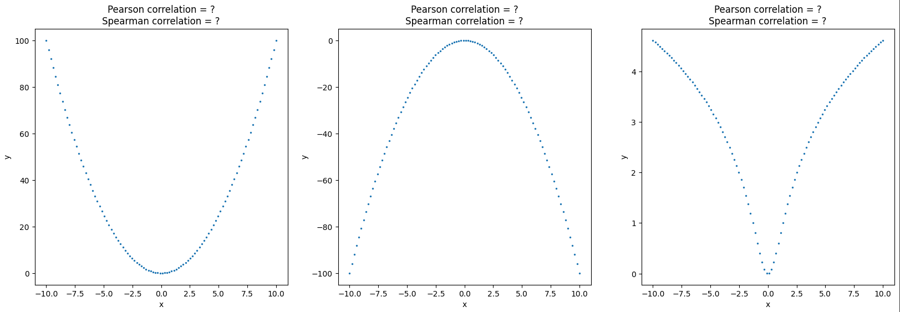

# Прикладная статистика

>Знакомство с доверительными интервалами, A/B тестами и корреляционным анализом \
Для этого решим задачи бизнес-анализа применительно к сети пиццерий \
Данные о заказах сети находяться [здесь](datasets/pizza.csv)

## Доверительные интервалы
Доверительные интервалы, в пределах которых с заданной вероятностью находяться выборочные оценки статистических характеристик 
### Task 1
Построим гистограмму - зависимость количества проданной пиццы от дней недели и выведем те дни недели, в которых продано *больше* всего и *меньше* всего пиццы

### Task 2
Добавим новый столбец `cook_time`, содержащий время приготовлнения пиццы в *секундах* для каждого заказа \
Посчитаем и выведем среднее, медианное, максимальное и минимальное время затраченное на приготовления пиццы

### Task 3
Использую **numpy.std(ddof=1)** для расчёта стандартного отклонения, построим 95% доверительный интервал среднего времени изготовления пиццы

### Task 4
Чтоб оптимизировать меню, владелец пиццерий хочет учитывать время изготовления пиццы при определении её цены, поэтому необходимо найти и вывести название пиццы, у которой самая высокая верхняя граница доверительного интервала для времени изготовления \
Учитываем только пиццы, которые заказывали более 100 раз

### Task 5
Владелец сети хочет исключить из меню пиццу с нестабильным временем изготовления, для этого нужно найти и вывести название пиццы с самым широким доверительным интервалом для времени изготовления \
Учитываем только пиццы, которые заказывали более 100 раз

## A/B тестирование
Для повышения продаж было принято решение и дизайнеры разработали новый рекламный баннер, необходимо выяснить, какой баннер нравится посетиелям сайта больше старый или новый \
Чтобы выяснить это, посетителям сайта предложили проголосовать за лучший баннер, результаты голосования собраны [здесь](datasets/click.csv)

### Task 6 
Проанализируем результаты голосования: нулевая гипотеза (H0) - старый баннер (`banner_a`) лучше; альтернативная гипотеза (H1) - новый баннер (`banner_b`) лучше \
Используя метод **proportion_confint** библиотеки **statsmodels** построим 95% доверительные интервалы для доли старого и нового баннеров и посмотрим пересекаются ли они

### Task 7
Для улучшения качества оценки построим  95% доверительный интервал для разности двух долей

### Task 8
Проведём, собственно, *A/B тест* и выясним какую гипотезу H0 или H1 принимаем

## Корреляции
Корреляции используется в статистике, чтобы оценить зависимость переменных друг от друга \
Мы рассмотрим корреляции **Пирсона** и **Спирмена**
### Task 9
Сгенерируем выборки и посчитаем коэффициенты коррелиций **Пирсона** и **Спирмена** для выборок `x-y1`, `x-y2`, `x-y3` \
Отрисуем выборки в таком виде

Проанализируем значения корреляций

### Task 10
Построим облако из тысячи точек и посчитаем коэффициенты корреляций **Пирсона** и **Спирмена** \
Затем, для имитации выбросов, случайным образом выберем четыре точки, каждую из которых будем передвигать в правый верхний угол относительно облака и выведем график облако с выбросами \
Для каждого случая посчитаем коэффициенты корреляций **Пирсона** и **Спирмана** и проанализируем значения корреляций
